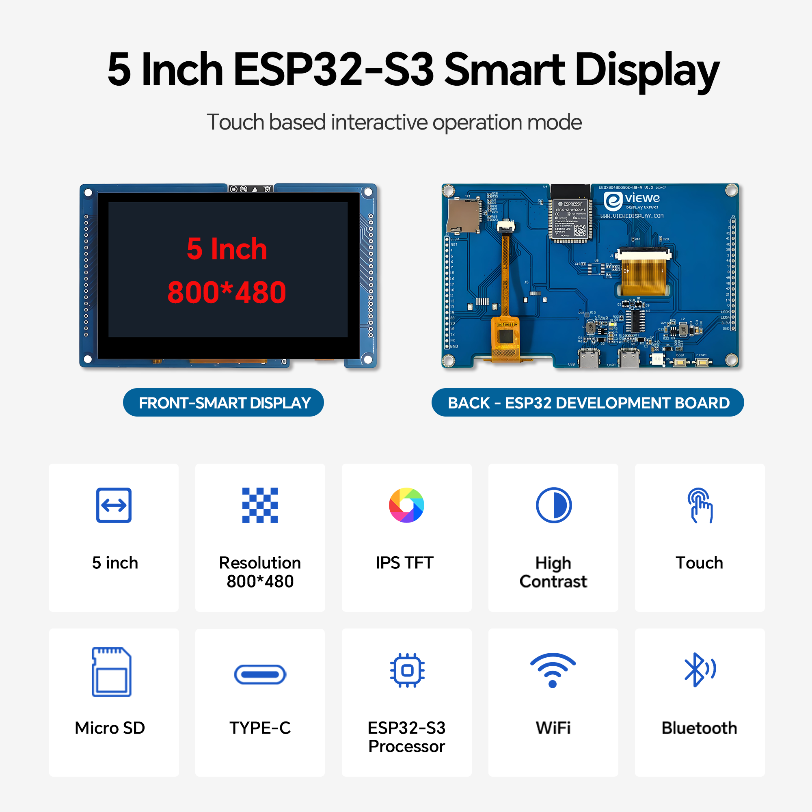
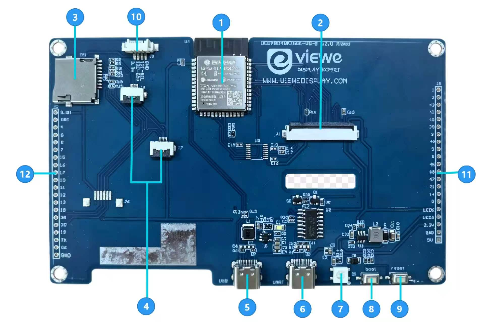
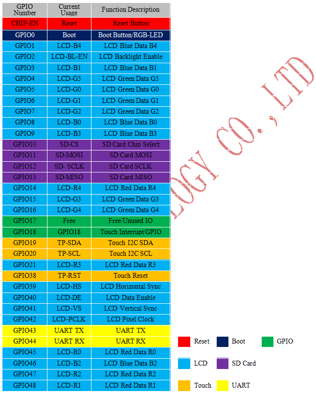
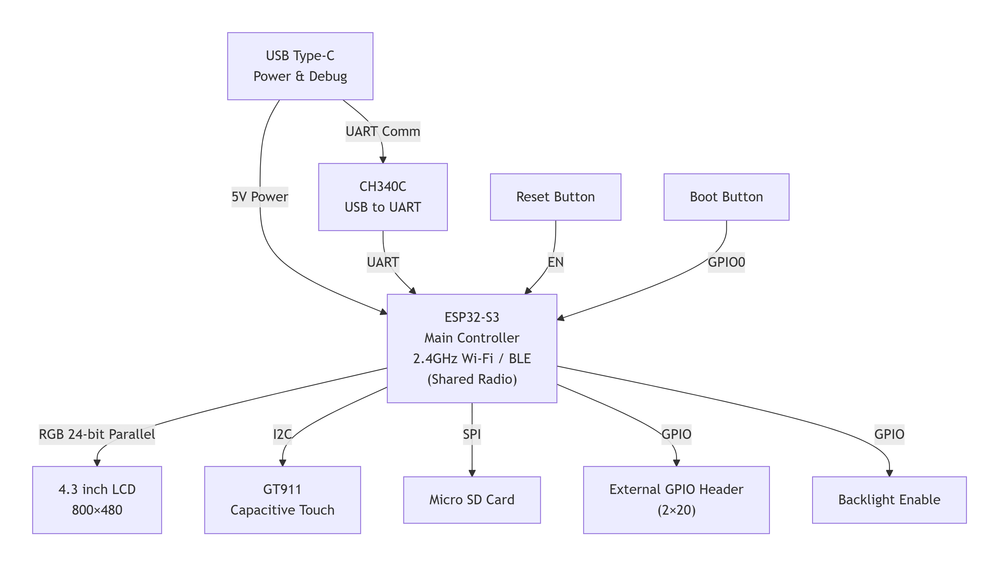
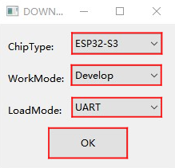
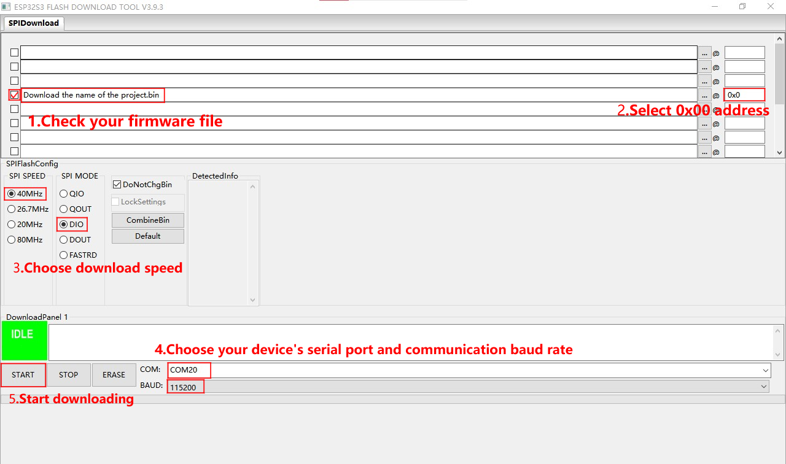

<h1 align = "center">VIEWE 5.0" 800*480 ESP32-S3 智能显示屏快速指南 </h1>

* **[English](./README.md)**

<p align="center">
    
</p>

---

## 1. 简介

UEDX80480050E-WB-B 是一款基于 ESP32-S3 的高性能智能显示开发板，配备 5.0 英寸 RGB 触摸屏（800x480）。它由 VIEWE 设计，适用于需要丰富外设接口和 Wi-Fi/BLE 连接的物联网及人机界面应用。

> [!NOTE]
> UEDX80480050E-WB-A 开发板将逐步停产，由 UEDX80480050E-WB-B 开发板替代。
> 建议新设计迁移至此版本。

### 1.1 产品特性

**CPU:**
- **处理器**
  - 搭载 Xtensa 32 位 LX7 双核处理器，主频高达 240 MHz。
  - 集成 Wi-Fi 2.4GHz (802.11 b/g/n) 与蓝牙 5 (LE) 及 BLE Mesh。
- **存储器**
  - 8 MB PSRAM。
  - 16 MB Flash。
- **外设接口**
  - 板载两组 2\*21 排针，引出多个可编程 GPIO，支持 SPI、UART、I2C、I2S、LCD、Camera、USB OTG 等接口。
  - 板载 USB Type-C 接口，用于供电、编程和串口调试（CH340C）。
  - 板载 Micro SD 卡槽（SPI 接口）。
  - 复位和 Boot 按钮。

**显示屏:**
- 尺寸：4.3 英寸
- 分辨率：800 \* 480
- 像素排列：RGB 垂直条纹
- 接口模式：40PIN RGB 24bits
- 驱动 IC：ST7262/ST72611
- 触摸 IC：GT911
- 亮度：400/500 cd/m²
- 触摸类型：电容触摸屏
> [!NOTE]
> 我们有两种显示屏。二者硬件方面仅触控排线位置和长度存在差异，其余完全一致。我们将根据现有库存对显示屏进行选配组装。

**其他:**
- 工作温度：-20~70℃
- 存储温度：-30~80℃

### 1.2 应用领域

凭借丰富的连接性和强大的处理能力，UEDX80480050E-WB-B 是以下领域物联网设备的理想选择：

- 智能家居控制面板
- 工业自动化人机界面
- 智能家电
- 消费电子产品
- 无线数据记录器
- 触摸屏界面
- 教育学习平台

---

## 2. 产品信息

### 2.1 接口说明



1. **主控芯片：** ESP32S3-MCN16R8  
   双核处理器，最高运行频率 240MHz。

2. **显示屏接口：**  
   40-Pin RGB 24-bit 显示输出，支持 R0-R7、G0-G7、B0-B7。但由于芯片限制，实际只能使用 RGB565。具体 I/O 详细信息请参考下方的显示屏接口表。

3. **SD 卡槽**  
   通过 SPI 接口连接，用于外部存储扩展。

4. **触摸接口**  
   I2C 接口（SDA/SCL），外加 GT911 电容触摸屏所需的中断与复位引脚。具体 I/O 详细信息请参考下方的触摸屏接口表。

5. **USB Type-C 接口**  
   用于 5V 直流供电。

6. **UART 串口**  
   标准 TX/RX 连接，用于调试或通信。

7. **RGB-LED (WS2812B)**

8. **Boot 按钮**  
   BOOT 按钮（GPIO0），用于进入固件下载模式。

9. **复位按钮**  
   RESET 按钮（CHIP-EN），用于复位开发板。

10. **4-pin 1.5mm 接口**  
    可根据实际需求选择使用 I2C、UART 等接口。如果担心干扰，可移除开发板上的 RGB 灯。

11. & 12. **外部 GPIO 排针**  
    双排 2\*21 排针，可访问多种 GPIO，包括 ADC、触摸传感器和标准数字 I/O。
> [!NOTE]
> 我司将根据实际情况进行屏幕配置，从两款触控屏中选用其一，二者不会同时配备。

#### 显示屏接口

| 引脚编号 | 符号 | I/O | 描述 |
|---------|--------|-----|-------------|
| 1       | LEDK   | P   | 背光阴极供电 |
| 2       | LEDA   | P   | 背光阳极供电 |
| 3       | GND    | P   | 电源地 |
| 4       | VDD    | P   | 内部逻辑电源调节器供电（3.3V） |
| 5-12    | R0-R7  | I   | 红色数据输入。 |
| 13-20   | G0-G7  | I   | 绿色数据输入。 |
| 21-28   | B0-B7  | I   | 蓝色数据输入。 |
| 29      | GND    | P   | 电源地 |
| 30      | CLK    | I   | 像素时钟输入引脚，负极性 |
| 31      | DISP   | I   | 待机模式。通常拉高。 |
| 32      | HSYNC  | I   | 行同步信号，负极性 |
| 33      | VSYNC  | I   | 场同步信号，负极性 |
| 34      | DEN    | I   | 数据输入使能。当 DE 为“H”时，允许访问显示。 |
| 35      | NC     | I   | 空脚 |
| 36      | GND    | P   | 电源地 |
| 37      | XR     | -   | 空脚 |
| 38      | YD     | -   | 空脚 |
| 39      | XL     | -   | 空脚 |
| 40      | YU     | -   | 空脚 |

*I：输入；O：输出；P：电源*

#### 触摸屏接口

| 引脚编号 | 符号  | I/O | 描述 |
|---------|---------|-----|-------------|
| 1       | GPIO20  | P   | 触摸屏 SCL |
| 2       | GPIO19  | P   | 触摸屏 SDA |
| 3       | GPIO18  | P   | 中断（实际未使用） |
| 4       | GND     | P   | 电源地 |
| 5       | VDD     | I   | 内部逻辑电源调节器供电（3.3V） |
| 6       | GPIO38  | I   | 触摸屏复位 |
| 7       | GND     | P   | 电源地 |
| 8       | GND     | P   | 电源地 |

### 2.2 GPIO 定义



---

## 3. 功能框图



> **注意：** ESP32-S3 内置 2.4 GHz 射频，支持 Wi-Fi (802.11 b/g/n) 和蓝牙 5 (LE)。由于二者共用同一射频前端，Wi-Fi 和 BLE 无法同时收发；射频会在协议之间按需切换。这在框图里以“共享射频（Shared Radio）”表示。

---

## 4. 软件

我们为 **Arduino**、**PlatformIO** 和 **ESP-IDF** 框架提供全面支持，并带有预移植的 **LVGL** 示例。

> [!TIP]
> UEDX80480050E-WB-A 和 UEDX80480050E-WB-B 在软件上没有区别。因此，下面我们将统一以 UEDX80480050E-WB-A 作为开发板的名称进行说明。

### 4.1 软件示例
示例可在 [GitHub 仓库(examples)](/examples) 中找到。

| 框架 | 示例路径 | 描述 |
| :--- | :--- | :--- |
| **Arduino** | `examples/arduino/gui/lvgl_v8` | **LVGL 基准测试**：演示 800x480 UI 渲染。也可直接在 Arduino IDE 中打开。 |
| **esp-idf** | `examples/esp_idf/lvgl_v9_demo_5inch` | **lvgl 移植**：在 esp-idf 中移植并使用 lvgl 的示例 |
| **esp-idf** | `examples/esp_idf/squareline_coffee_5inch` | **squareline 移植**：在 esp-idf 中移植并使用 squareline 的示例 |
| **esp-idf** | `examples/esp_idf/sd_card_spi` | **sd_card**：在设备上使用 SD 卡的示例 |
| **PlatformIO**| `examples/platformio/lvgl_v8_port` | **lvgl v8 移植**：lvgl v8 的使用示例。 |

### 4.2 入门指南

#### 4.2.1 准备工作
* **硬件**：UEDX80480043E-WB-A 或 UEDX80480050E-WB-B 开发板，USB-C 数据线。
* **软件**：VS Code (ESP-IDF v5.3+) 或 Arduino IDE (v2.0+) 或 VS Code (PlatformIO)。
* **库**：Arduino IDE 和 PlatformIO 需要以下库

    | 库 | 版本 | 描述 |
    | :--- | :--- | :--- |
    |`ESP32_Display_Panel`| `1.0.3+` |乐鑫提供，驱动屏幕所必需。|
    |`ESP32_IO_Expander`| `Arduino 自动选择` |`ESP32_Display_Panel` 的依赖库，安装过程中会提示一并安装。|
    |`esp-lib-utils`| `Arduino 自动选择` |`ESP32_Display_Panel` 的依赖库，安装过程中会提示一并安装。|
    |`lvgl`| `8.4.0` | 免费开源的嵌入式图形库。 |

#### 4.2.2 ESP-IDF 环境搭建
1.  **打开 platformio 示例**
    * 前往 GitHub 下载程序。可点击绿色的 "<> Code" 按钮下载主分支。
    * 使用 VS Code (ESP-IDF) 打开示例。
2.  **编译和上传**:
    * 点击右上角的 `build` 进行编译。
    * 将单片机连接到电脑。如果编译正确，
    * 点击右上角的 `upload` 进行下载。

#### 4.2.3 Arduino 环境搭建([新手教程](https://github.com/VIEWESMART/VIEWE-Tutorial/blob/main/Arduino%20Tutorial/Arduino%20Getting%20Started%20Tutorial.md))
1.  **安装 ESP32 开发板包**:
    * 进入 *工具 > 开发板 > 开发板管理器*。
    * 搜索乐鑫的 `esp32` 并安装版本 **3.0.0+**。
2.  **安装库**:
    * 进入 *项目 > 加载库 > 库管理器*。
    * 搜索乐鑫的 `ESP32_Display_Panel` 并安装版本 **1.0.3+**。系统将提示是否安装其依赖项，请点击 **INSTALL ALL** 全部安装。
    * 安装 `lvgl` (推荐 v8.4.0)。
3.  **打开示例**:
    * 导航到 `文件` > `示例` > `ESP32_Display_Panel`
    * 选择 `Arduino` > `gui` > `lvgl_v8` > `simple_port`
4.  **选择开发板**:
    * 目标：`ESP32S3 Dev Module`。
    * 设置：
        * **Flash Size**: 16MB (128Mb)
        * **Partition Scheme**: 16M Flash (3MB APP/9.9MB FATFS)
        * **PSRAM**: **OPI PSRAM** (至关重要！)
5.  **配置乐鑫支持的开发板**:
    * 打开示例中的 `esp_panel_board_supported_conf.h` 文件
    * 启用此文件：将 `ESP_PANEL_BOARD_DEFAULT_USE_SUPPORTED` 宏定义改为 `1`
    * 确保取消注释：`#define BOARD_VIEWE_UEDX80480050E_WB_A`
    ```c
    ...
    /**
     * @brief 启用支持的开发板配置的标志 (0/1)
     *
     * 设置为 `1` 以启用支持的开发板配置，`0` 为禁用
     */
    #define ESP_PANEL_BOARD_DEFAULT_USE_SUPPORTED       (1)
    ...
    // #define BOARD_VIEWE_SMARTRING
    // #define BOARD_VIEWE_UEDX24240013_MD50E
    // #define BOARD_VIEWE_UEDX24320024E_WB_A
    // #define BOARD_VIEWE_UEDX24320028E_WB_A
    // #define BOARD_VIEWE_UEDX24320035E_WB_A
    // #define BOARD_VIEWE_UEDX32480035E_WB_A
    // #define BOARD_VIEWE_UEDX46460015_MD50ET
    // #define BOARD_VIEWE_UEDX48270043E_WB_A
    // #define BOARD_VIEWE_UEDX48480021_MD80E_V2
    // #define BOARD_VIEWE_UEDX48480021_MD80E
    // #define BOARD_VIEWE_UEDX48480021_MD80ET
    // #define BOARD_VIEWE_UEDX48480028_MD80ET
    // #define BOARD_VIEWE_UEDX48480040E_WB_A
    // #define BOARD_VIEWE_UEDX80480043E_WB_A
    // #define BOARD_VIEWE_UEDX80480050E_AC_A
    #define BOARD_VIEWE_UEDX80480050E_WB_A
    // #define BOARD_VIEWE_UEDX80480050E_WB_A_2
    // #define BOARD_VIEWE_UEDX80480070E_WB_A
    ...
6.  **配置示例**:
    - [可选] 编辑 `lvgl_v8_port.h` 文件中的宏定义
        - **如果使用 `RGB/MIPI-DSI` 接口**，将 `LVGL_PORT_AVOID_TEARING_MODE` 宏定义修改为 `1`/`2`/`3` 以启用防撕裂功能。之后，将 `LVGL_PORT_ROTATION_DEGREE` 宏定义修改为目标旋转角度。
        - **如果使用其他接口**，请不要修改 `LVGL_PORT_AVOID_TEARING_MODE` 和 `LVGL_PORT_ROTATION_DEGREE` 宏定义。
    - [可选] 编辑 `lv_conf.h` 文件中的宏定义
        - **如果使用 `SPI/QSPI` 接口**，将 `LV_COLOR_16_SWAP` 宏定义修改为 `1`。
7.  **选择正确的端口**:
    * 连接设备。
    * 进入 *工具 > 端口*，选择对应的端口。
8.  **编译和上传**:
    * 点击左上角的 `√` 进行编译。
    * 将单片机连接到电脑。如果编译正确，
    * 点击左上角的 `→` 进行下载。

> [!TIP]
> **配置**：在 `esp_panel_board_supported_conf.h` 中，确保取消注释：
> `#define BOARD_VIEWE_UEDX80480050E_WB_A`
> 不要同时启用 `ESP_PANEL_BOARD_DEFAULT_USE_SUPPORTED` 和 `ESP_PANEL_BOARD_DEFAULT_USE_CUSTOM`
> 不能同时启用多个乐鑫支持的开发板。

### 4.2.4 PlatformIO 环境搭建
1.  **打开 platformio 示例**
    * 前往 GitHub 下载程序。可点击绿色的 "<> Code" 按钮下载主分支。
    * 使用 VS Code (PlatformIO) 打开示例。
2.  **配置 PlatformIO**:
    * 此示例默认使用 `BOARD_ESPRESSIF_ESP32_S3_LCD_EV_BOARD_2_V1_5` 开发板。请在 `platformio.ini` 文件的 `[platformio]:default_envs` 中选择 `BOARD_VIEWE_UEDX80480050E_WB_A`。
3.  **配置示例**:
    - [可选] 编辑 `lvgl_v8_port.h` 文件中的宏定义
        - **如果使用 `RGB/MIPI-DSI` 接口**，将 `LVGL_PORT_AVOID_TEARING_MODE` 宏定义修改为 `1`/`2`/`3` 以启用防撕裂功能。之后，将 `LVGL_PORT_ROTATION_DEGREE` 宏定义修改为目标旋转角度。
        - **如果使用其他接口**，请不要修改 `LVGL_PORT_AVOID_TEARING_MODE` 和 `LVGL_PORT_ROTATION_DEGREE` 宏定义。
4.  **编译和上传项目**
    - 点击 `√`（编译）按钮
    - 将开发板连接到电脑。如果编译正确，
    - 点击 `→`（上传）按钮

---

## 5. 相关文档

- [产品规格书(WB-A)](datasheet/UEDX80480043E-WB-A%20V3.2%20SPEC.pdf)
- [产品规格书(WB-B)](datasheet/UEDX80480043E-WB-B%20V1.0%20SPEC.pdf)
- [UEDX80480043E-WB-A 原理图 (PDF)](Schematic/UEDX48480043E-WB-A%20V1.3.SCH.pdf)
- [UEDX80480043E-WB-B 原理图 (PDF)](Schematic/UEDX80480043E-WB-B.pdf)
- [2D 图纸 (dwg)](2D%20drawings/PLCM-DX80480043E-WB-B.dwg)
- [显示屏规格书 (PDF)](datasheet/UE043WV-RB40-A070A_V1.0.pdf)
- [显示驱动芯片规格书 (PDF)](datasheet/ST7262.pdf)
- [触摸芯片规格书 (中文)](datasheet/n/GT911_CN_Datasheet.pdf)
- [触摸芯片规格书 (英文)](datasheet//GT911_EN_Datasheet.pdf)
- [ESP32-S3-WROOM-1 数据手册 (中文)](datasheet/esp32-s3-wroom-1_wroom-1u_datasheet_cn.pdf)
- [ESP32-S3-WROOM-1 数据手册 (英文)](datasheet/esp32-s3-wroom-1_wroom-1u_datasheet_en.pdf)

---

## 6. 固件下载
1. 打开项目文件“tools”，找到 ESP32 烧录工具并打开。

2. 选择正确的烧录芯片和烧录方式，然后点击“确定”。如图所示，按照步骤 1->2->3->4->5 烧录程序。如果烧录不成功，请按住“BOOT-0”按钮，然后再次下载烧录。

3. 烧录项目根目录下的“[firmware](./firmware/)”文件夹中的文件，里面有固件版本说明，选择合适的版本下载即可。

<p align="center" width="100%">
    
    
</p>

---

## 7. 常见问题

* Q. 阅读以上教程后，我仍然不知道如何搭建编程环境，该怎么办？
* A. 如果阅读以上教程后仍不清楚如何搭建环境，可以参考 [VIEWE-FAQ]() 文档说明进行搭建。

<br />

* Q. 为什么打开 Arduino IDE 时提示更新库文件？我应该更新吗？
* A. 不要更新库文件。不同版本的库文件可能互不兼容，因此不建议更新库文件。

<br />

* Q. 为什么我板子上的“Uart”接口没有串口数据输出？是坏了不能用吗？
* A. 默认项目配置使用 USB 接口作为 Uart0 串口输出用于调试。“Uart”接口连接的是 Uart0，因此没有配置就不会输出数据。<br />对于 PlatformIO 用户，请打开项目文件“platformio.ini”，将“build_flags = xxx”下的选项从 “-D ARDUINO_USB_CDC_ON_BOOT=true” 改为 “-D ARDUINO_USB_CDC_ON_BOOT=false”，即可启用外部“Uart”接口。<br />对于 Arduino 用户，打开“工具”菜单，选择“USB CDC On Boot: Disabled”以启用外部“Uart”接口。

<br />

* Q. 为什么我的板子一直下载失败？
* A. 请按住“BOOT”按钮，然后重新尝试下载程序。

